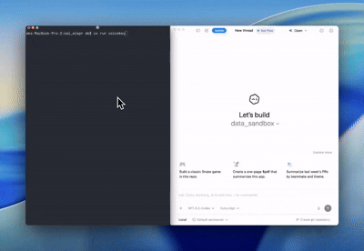

<p align="center">
  <h1 align="center">voicekey</h1>
  <p align="center">
    <strong>Open-source voice dictation for macOS.</strong><br>
    Hold Option. Speak. Release. Text appears at your cursor.
  </p>
  <p align="center">
    <a href="https://pypi.org/project/voicekey/"></a>
    <a href="https://github.com/adamkhakhar/voicekey/actions/workflows/ci.yml"></a>
    <a href="https://github.com/adamkhakhar/voicekey/blob/main/LICENSE"></a>
    
    
  </p>
</p>

<br>

<!-- TODO: Add demo GIF here -->
<!-- <p align="center"></p> -->

No subscription, no third-party servers. Your API key, one hotkey, and you're dictating.

Uses OpenAI's `gpt-4o-mini-transcribe` by default, with a pluggable provider system so you can swap in other transcription backends. Audio goes straight from your mic to the API over HTTPS, text comes back in under a second, gets pasted at your cursor. Costs about $0.003/minute with OpenAI.

<br>

## Why this exists

[Wispr Flow](https://wispr.flow) is good, but lots of companies (including OpenAI itself) block third-party services that process audio. If your employer won't let you install Wispr, or you'd rather not pay $10/month for dictation, this does the same thing with your own API key.

<br>

## How it compares

| | **voicekey** | **Wispr Flow** | **macOS Dictation** | **whisper.cpp** |
|---|---|---|---|---|
| Cost | ~$0.003/min (API) | $10/month | Free | Free (local) |
| Privacy | Your API key, direct to provider | Audio goes to Wispr servers | Audio goes to Apple servers | Fully local |
| Allowed at work | Yes (your own key) | Often blocked by IT | Usually allowed | Yes |
| Accuracy | GPT-4o-mini-transcribe | Proprietary | Apple ML | Open-source Whisper |
| Latency | Sub-second | Sub-second | ~1-2s | Depends on hardware |
| Paste at cursor | Yes | Yes | Yes | No (manual copy) |
| Works in any app | Yes | Yes | Yes | No (terminal only) |
| Open source | Yes | No | No | Yes |
| Setup time | 2 minutes | Account + install | Built-in | Compile from source |

<br>

## How it works

```
Hold Option → Recording → Release Option → Transcribe → Paste at cursor
```

1. Hold the Option key. A red dot appears on screen, recording starts.
2. Talk.
3. Release Option. Audio gets sent to the transcription API, text streams back and gets typed wherever your cursor is.
4. Your clipboard is untouched. It's saved before the paste and restored after.

<br>

## Install

### Prerequisites

- macOS 13+
- Python 3.11+
- PortAudio: `brew install portaudio`

### pipx (recommended)

```bash
brew install portaudio
pipx install voicekey
voicekey setup
```

### From source with uv

```bash
brew install portaudio
git clone https://github.com/adamkhakhar/voicekey.git
cd voicekey
uv sync
uv run voicekey setup
```

Setup will ask for your API key (goes into macOS Keychain, never touches disk) and walk you through Accessibility and Microphone permissions.

### Run

```bash
voicekey          # if installed via pipx
uv run voicekey   # if installed via uv
```

A mic icon shows up in your menu bar. Hold Option to dictate.

<br>

## Permissions

macOS needs two permissions granted:

| Permission | Why | How to grant |
|---|---|---|
| Accessibility | Global hotkey detection + simulating Cmd+V to paste | System Settings → Privacy & Security → Accessibility → add your terminal |
| Microphone | Recording audio | Dialog pops up on first use |

`voicekey setup` checks both and opens the right Settings pane if either is missing.

<br>

## Configuration

Config file is at `~/.config/voicekey/config.toml`.

```bash
voicekey config                       # view all settings
voicekey config language en           # set language (ISO 639-1)
voicekey config model gpt-4o-transcribe   # higher-accuracy model (~$0.006/min)
voicekey config hotkey left_option    # trigger on left Option only
```

| Key | Default | Options |
|---|---|---|
| `provider` | `openai` | `openai` (more coming) |
| `model` | `gpt-4o-mini-transcribe` | `gpt-4o-mini-transcribe`, `gpt-4o-transcribe` |
| `hotkey` | `option` (either) | `option`, `left_option`, `right_option` |
| `language` | `""` (auto-detect) | Any [ISO 639-1](https://en.wikipedia.org/wiki/List_of_ISO_639-1_codes) code |

<br>

## Architecture

```
┌─────────────────────────────────────────────────────┐
│  Main thread (NSApp run loop)                       │
│  ┌──────────┐  ┌─────────┐  ┌────────────────────┐ │
│  │ CGEvent  │→ │ rumps   │  │ Overlay (NSWindow) │ │
│  │ tap      │  │ menubar │  │ red dot indicator  │ │
│  └──────────┘  └─────────┘  └────────────────────┘ │
├─────────────────────────────────────────────────────┤
│  Audio thread (sounddevice callback)                │
│  24kHz mono int16 PCM → WAV encoding                │
├─────────────────────────────────────────────────────┤
│  Transcription thread (per utterance)               │
│  Provider.transcribe() → paste at cursor            │
└─────────────────────────────────────────────────────┘

State machine: IDLE → RECORDING → TRANSCRIBING → INSERTING → IDLE
```

Providers are pluggable. The `providers/` package defines a `Protocol` that any transcription backend can implement. OpenAI is the default. To add a new provider, implement `transcribe()` in a new module and register it.

There's a 200ms debounce on the Option key so it doesn't fire when you're typing special characters (Option+E for accents, etc).

<br>

## Security and privacy

Your API key is stored in the macOS Keychain through the `keyring` library, not in a config file. Audio goes directly to your chosen provider's API over HTTPS with no middleman. There's no telemetry, no analytics, nothing phoning home. The clipboard gets saved before pasting transcribed text and restored right after. The whole thing is ~900 lines of Python you can read in 20 minutes.

<br>

## Troubleshooting

**"Failed to create event tap"** -
Your terminal doesn't have Accessibility permission. Add it in System Settings → Privacy & Security → Accessibility, then restart voicekey.

**No audio captured** -
Check that your terminal has Microphone permission in System Settings → Privacy & Security → Microphone.

**Text not appearing at cursor** -
A few apps with custom input handling don't respond to simulated Cmd+V. Most standard apps work.

**PortAudio errors on install** -
`brew install portaudio` first.

<br>

## Contributing

Contributions are welcome. Open an issue first if you want to discuss a change.

```bash
git clone https://github.com/adamkhakhar/voicekey.git
cd voicekey
uv sync
uv run pytest tests/ -v
```

<br>

## License

[MIT](LICENSE)
